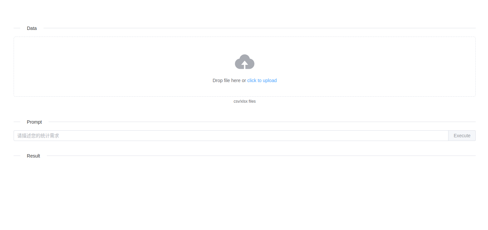
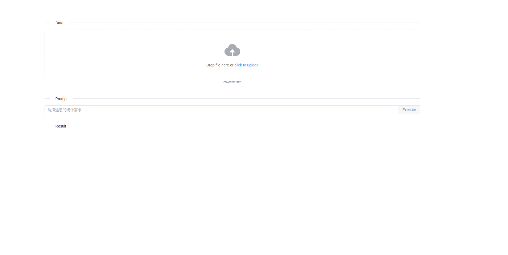
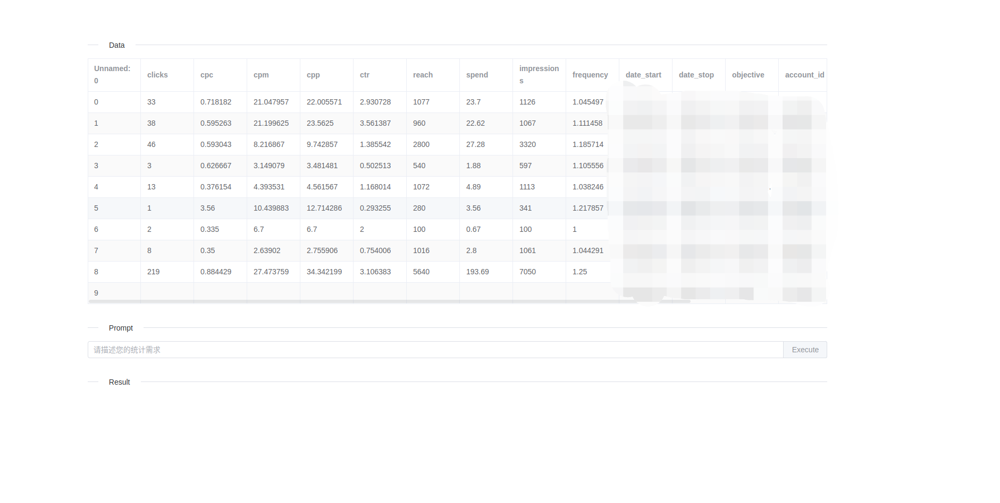

# ChatGPT数据分析助手

- 简介：
       ChatGPT数据分析助手是一款专业的数据库及表格数据分析及应用工具，采用先进的对话式交互方式，让您轻松应对各种业务场景。它能帮助您轻松解决数据分析问题，减轻数据分析学习压力，让您专注于业务需求，提高数据价值和分析效率。
- 技术：
   - ChatGPT数据分析助手:  OpenAI API, Langchain等
   - 开发环境：Ubuntu 20.04
   - 试用地址： [试用访问](https://cd.aib.lol/)

## ChatPandas

界面：界面分为三个主要部分,数据区、提示区和数据结果区，具体介绍如下：

1. 数据区：位于界面顶部，主要用于上传数据文件以及展示文件中的示例数据。您可以在此区域轻松上传需要分析的数据文件，同时预览其中的数据内容。
2. 提示区：位于数据区下方，用于输入您的数据需求和问题的文字描述。请在此区域清晰地描述您希望从数据中获取的信息，以便ChatGPT数据分析助手为您提供准确的分析结果。
3. 数据结果区：位于提示区下方，主要展示数据分析过程和最终的数据分析结果。在此区域，您可以直观地了解到数据分析的进展，并在分析完成后查看详细的结果报告。

<aside>
💡 界面

</aside>

## 使用步骤

<aside>
💡 Step1 上传数据，使用选择数据文件或拖拽的方式到数据区域

Step2 编写数据需求，数据预览

Step3 获取分析结果

## ChatSQL

